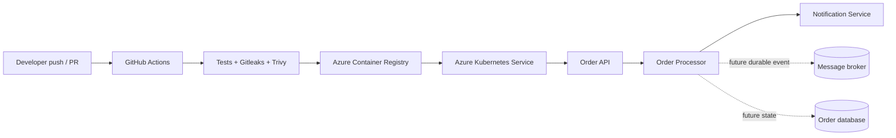

# Architecture

`order-api` accepts a validated order and returns `202 Accepted`. In the learning implementation, the processor and notification endpoints model the next service boundaries. In production, the API would publish an order event to a durable broker; the processor would consume it, persist status, and publish a notification event. This avoids synchronous coupling and allows each worker to scale independently.

Internal Kubernetes DNS names are `order-processor` and `notification-service`. Only `order-api` is exposed through a cloud load balancer. Actuator health endpoints are used by Kubernetes probes.

The development Helm profile uses one replica per service. The production profile uses two replicas and enables Kubernetes Horizontal Pod Autoscaling from 2 to 6 replicas based on CPU utilization. Resource requests and limits are profile-specific so scheduling and cost decisions remain explicit.

## Security boundaries

AKS uses a system-assigned identity with the minimum `AcrPull` role on ACR. Containers run as UID 10001 with dropped Linux capabilities. GitHub Actions authenticates to Azure through OIDC. Secrets and Terraform state stay outside Git.